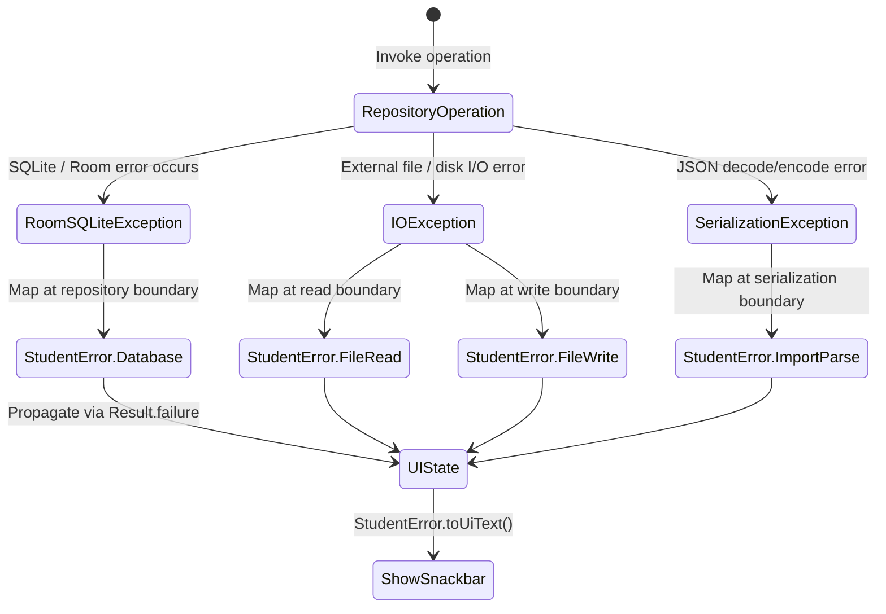

# Data Model: StudentError Unified Hierarchy

This document specifies the structure of the `StudentError` entity, which serves as the unified error model across the Domain, Data, and Presentation layers.

## Entity: `StudentError` (Sealed Class)

`StudentError` extends `Throwable` so it can be wrapped natively in Kotlin's `Result.failure()` API.

### Subclasses and Fields

| Subclass | Type | Fields / Properties | Description | Localized Mapping (English / Arabic) |
|---|---|---|---|---|
| `Database` | `object` | None | DB reading, writing, or constraint issues (Room/SQLite). | "Database operation failed." / "فشلت عملية قاعدة البيانات." |
| `DuplicateClass` | `object` | None | Attempt to create/rename class to an existing name. | "A class with this name already exists." / "يوجد بالفعل صف بنفس الاسم." |
| `FileRead` | `object` | None | Failure to open, read, or locate a file. | "Error reading file." / "خطأ في قراءة الملف." |
| `FileWrite` | `object` | None | Failure to write data to external storage. | "Error writing file." / "خطأ في كتابة الملف." |
| `ImportParse` | `object` | None | JSON decoding or structural validation failure. | "Error parsing import file." / "خطأ في تحليل ملف الاستيراد." |
| `ReportGeneration` | `object` | None | Failure during report generation (bitmap compress/save). | "Failed to generate report." / "فشلت عملية توليد التقرير." |
| `Validation` | `class` | `message: String` | Interactive input validation constraint violations. | Dynamic input string / Dynamic message |
| `Cancelled` | `object` | None | System/user cancelled operations (e.g. file selection). | "Operation cancelled." / "تم إلغاء اختيار الملف." |

---

## Validation & Uniqueness Rules

1. **Class Name Uniqueness**: Check `StudentClassDao.classNameExists(name)` before insert/update. If exists, repository returns `Result.failure(StudentError.DuplicateClass)`.
2. **Class Name Validation**: Class name must be non-blank. If blank, ViewModels/delegates return `Result.failure(StudentError.Validation("Class name must not be blank"))`.
3. **Student Name Validation**: Student name must be non-blank. If blank, ViewModels/delegates return `Result.failure(StudentError.Validation("Name must not be blank"))`.

---

## State / Error Transitions

